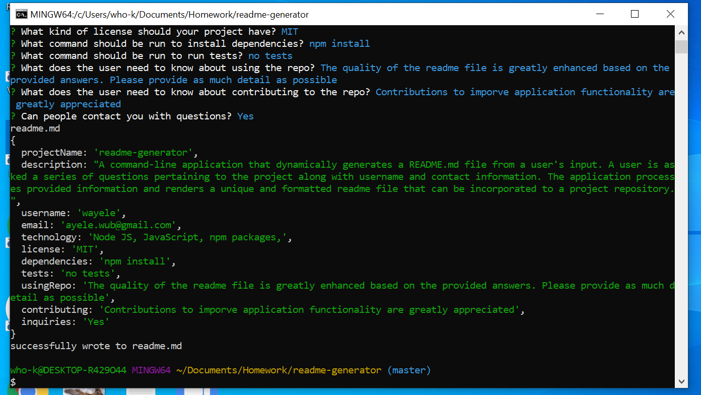
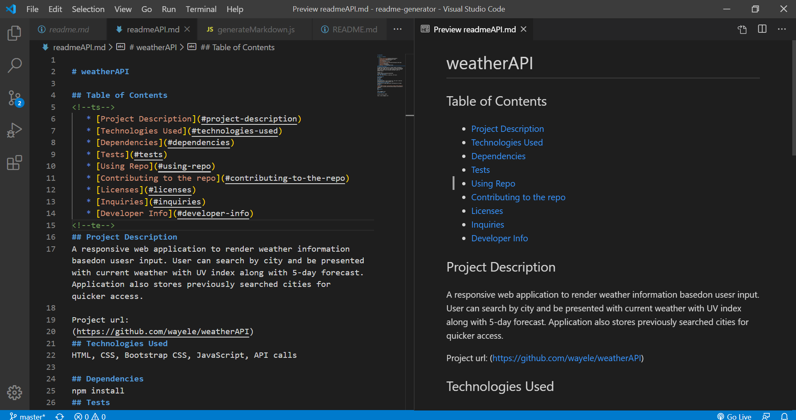
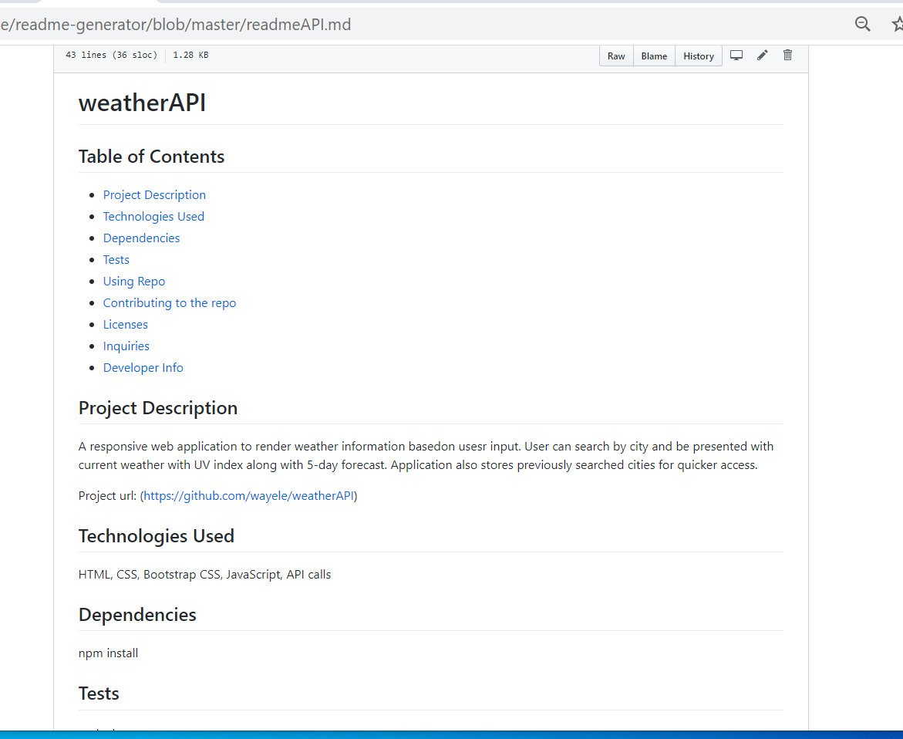

# readme-generator

## Table of Contents
<!--ts-->
   * [Project Description](#project-description)
   * [Technologies Used](#technologies-used) 
   * [Dependencies](#dependencies)
   * [Tests](#tests)
   * [Using Repo](#using-repo)
   * [Contributing to the repo](#contributing-to-the-repo)
   * [Licenses](#licenses)
   * [Inquiries](#inquiries)
   * [Developer Info](#developer-info)
<!--te-->
## Project Description
A command-line application that dynamically generates a README.md file from a user's input. A user is asked a series of questions pertaining to the project along with username and contact information. The application processes provided information and renders a unique and formatted readme file that can be incorporated to a project repository.

Project url: 
(https://github.com/wayele/readme-generator)
## Technologies Used
Node JS, JavaScript, npm packages,

## Screenshots
User is asked a series of questions requiring response 
A generated readme file based on the user's response 
A generated readme file from github 

## Dependencies
npm install
## Tests
no tests
## Using Repo
The quality of the readme file is greatly enhanced based on the provided answers. Please provide as much detail as possible
## Contributing to the repo
Contributions to imporve application functionality are greatly appreciated
## Licenses

MIT
## Inquiries
Yes

ayele.wub@gmail.com
## Developer Info:

Github username: wayele

Email: ayele.wub@gmail.com
